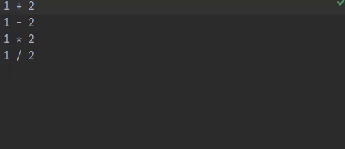

# Evaluate Arithmetic
A plugin for IntelliJ IDEs. Download [here](https://plugins.jetbrains.com/plugin/13778-evaluate-arithmetic).


Possibility to keep the expression if the expression is followed by an equal sign ("=")


  

## Building
To build the plugin and run tests, run:
 ```
./gradlew build
```
Find the generated plugin in `build/distributions` as a .zip file
