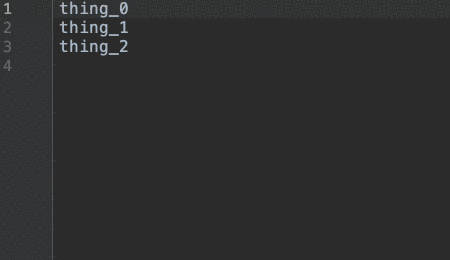

# Evaluate Arithmetic  

A plugin for IntelliJ IDEs. Download [here](https://plugins.jetbrains.com/plugin/13778-evaluate-arithmetic).



## Building
To build the plugin and run tests, run:
 ```
./gradlew build
```
Find the generated plugin in `build/distributions` as a .zip file
